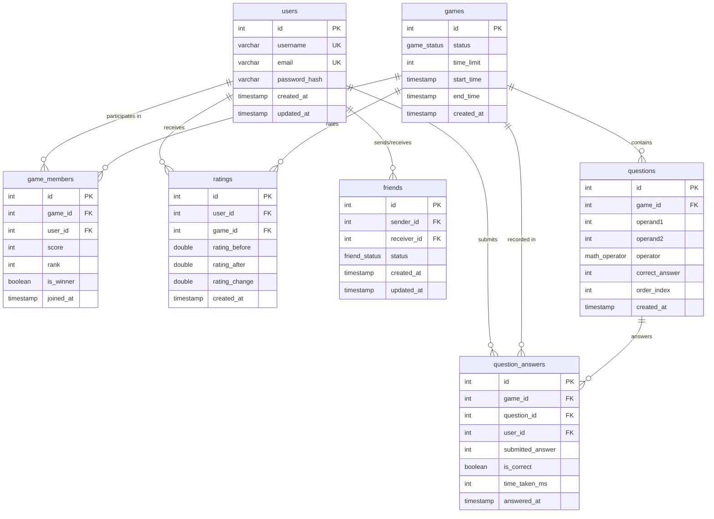

# PRD: Database Schema for Matik (Multiplayer Arithmetic Battle)

**Status:** Approved (via /grill-me session)  
**Target:** `packages/database/src/schemas/schema.ts`  
**ORM / Database:** Drizzle ORM (`drizzle-orm/pg-core`) on PostgreSQL

---

## 1. Overview & Goals

Matik is a fast-paced multiplayer arithmetic game where players solve rapid math questions, compete in real-time, track scores, connect with friends, and measure skill progression via ratings.

This document defines the production database schema for Drizzle ORM (`packages/database`), resolving all structural ambiguities identified during the schema grill-me review.

---

## 2. Domain Models & Architecture

---

## 3. Detailed Model Specifications

### 3.1 Enums
1. **`game_status_enum`**:
   - `'waiting'` (Lobby waiting for players)
   - `'in_progress'` (Game countdown / active solving)
   - `'completed'` (Game finished, scores settled)
   - `'abandoned'` (Game cancelled or timed out)

2. **`math_operator_enum`**:
   - `'+'`, `'-'`, `'*'`, `'/'`

3. **`friend_status_enum`**:
   - `'pending'`
   - `'accepted'`
   - `'rejected'`

---

### 3.2 Tables

#### A. `users` (`users`)
- `id`: `integer` primary key, `generatedAlwaysAsIdentity()`.
- `username`: `varchar(255)` unique, non-null.
- `email`: `varchar(255)` unique, non-null.
- `password`: `varchar(255)` non-null (salted hash).
- `createdAt`: `timestamp` default `now()`, non-null.
- `updatedAt`: `timestamp` default `now()`, non-null.

#### B. `games` (`games`)
- `id`: `integer` primary key, `generatedAlwaysAsIdentity()`.
- `status`: `game_status_enum`, default `'waiting'`, non-null.
- `timeLimit`: `integer`, default `60` (seconds), non-null.
- `startTime`: `timestamp` nullable (set when match begins).
- `endTime`: `timestamp` nullable (set when match finishes).
- `createdAt`: `timestamp` default `now()`, non-null.

#### C. `game_members` (`game_members`)
- `id`: `integer` primary key, `generatedAlwaysAsIdentity()`.
- `gameId`: `integer` foreign key referencing `games.id` (cascade on delete), non-null.
- `userId`: `integer` foreign key referencing `users.id` (cascade on delete), non-null.
- `score`: `integer` default `0`, non-null.
- `rank`: `integer` nullable (1st, 2nd, etc. determined post-game).
- `isWinner`: `boolean` default `false`, non-null.
- `joinedAt`: `timestamp` default `now()`, non-null.
- *Constraint*: Unique index on `(game_id, user_id)` to prevent duplicate registrations.

#### D. `questions` (`questions`)
- `id`: `integer` primary key, `generatedAlwaysAsIdentity()`.
- `gameId`: `integer` foreign key referencing `games.id` (cascade on delete), non-null.
- `operand1`: `integer` non-null.
- `operand2`: `integer` non-null.
- `operator`: `math_operator_enum` non-null.
- `correctAnswer`: `integer` non-null (precomputed for fast O(1) answer validation).
- `orderIndex`: `integer` default `0`, non-null (preserves question sequence).
- `createdAt`: `timestamp` default `now()`, non-null.

#### E. `question_answers` (`question_answers`)
- `id`: `integer` primary key, `generatedAlwaysAsIdentity()`.
- `gameId`: `integer` foreign key referencing `games.id` (cascade on delete), non-null.
- `questionId`: `integer` foreign key referencing `questions.id` (cascade on delete), non-null.
- `userId`: `integer` foreign key referencing `users.id` (cascade on delete), non-null.
- `submittedAnswer`: `integer` non-null.
- `isCorrect`: `boolean` non-null.
- `timeTakenMs`: `integer` nullable (latency / response time in milliseconds).
- `answeredAt`: `timestamp` default `now()`, non-null.

#### F. `friends` (`friends`)
- `id`: `integer` primary key, `generatedAlwaysAsIdentity()`.
- `senderId`: `integer` foreign key referencing `users.id` (cascade on delete), non-null.
- `receiverId`: `integer` foreign key referencing `users.id` (cascade on delete), non-null.
- `status`: `friend_status_enum` default `'pending'`, non-null.
- `createdAt`: `timestamp` default `now()`, non-null.
- `updatedAt`: `timestamp` default `now()`, non-null.
- *Constraints*:
  - Unique composite index on `(sender_id, receiver_id)` to avoid duplicate requests.
  - Check constraint ensuring `sender_id != receiver_id` (cannot friend oneself).

#### G. `ratings` (`ratings`)
- `id`: `integer` primary key, `generatedAlwaysAsIdentity()`.
- `userId`: `integer` foreign key referencing `users.id` (cascade on delete), non-null.
- `gameId`: `integer` foreign key referencing `games.id` (cascade on delete), non-null.
- `ratingBefore`: `doublePrecision` non-null (Elo before match).
- `ratingAfter`: `doublePrecision` non-null (Elo after match).
- `ratingChange`: `doublePrecision` non-null (positive/negative delta).
- `createdAt`: `timestamp` default `now()`, non-null.
- *Index*: `(user_id, created_at)` for fast Elo history charting.

---

## 4. Drizzle ORM Relations
Full bi-directional typed relations configured using `relations()`:
- `usersRelations`: has many `gameMembers`, `questionAnswers`, `ratings`, `sentFriendRequests`, `receivedFriendRequests`.
- `gamesRelations`: has many `gameMembers`, `questions`, `questionAnswers`, `ratings`.
- `gameMembersRelations`: belongs to `user`, belongs to `game`.
- `questionsRelations`: belongs to `game`, has many `answers`.
- `questionAnswersRelations`: belongs to `game`, belongs to `question`, belongs to `user`.
- `friendsRelations`: belongs to `sender` (user), belongs to `receiver` (user).
- `ratingsRelations`: belongs to `user`, belongs to `game`.

---

## 5. Type Exports & Public Interface
Export TypeScript types for inserts and selects:
- `User`, `NewUser`
- `Game`, `NewGame`
- `GameMember`, `NewGameMember`
- `Question`, `NewQuestion`
- `QuestionAnswer`, `NewQuestionAnswer`
- `Friend`, `NewFriend`
- `Rating`, `NewRating`
- Enums: `GameStatus`, `MathOperator`, `FriendStatus`
